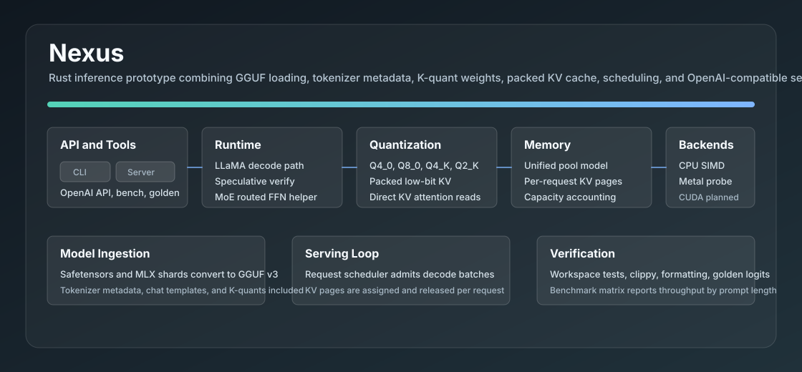
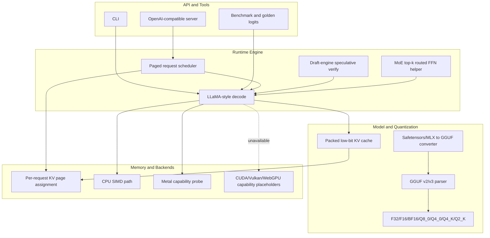
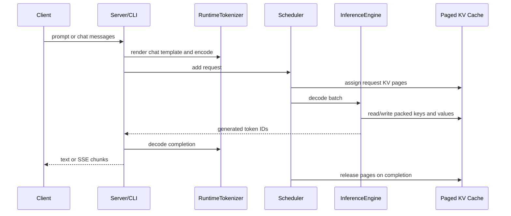
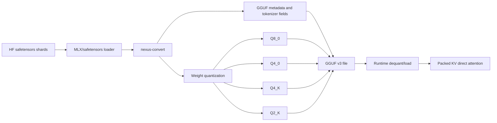

# Nexus

Nexus is a Rust inference engine prototype that combines GGUF loading, MLX-style safetensors ingestion, weight/KV quantization, and an OpenAI-compatible API surface.



## Architecture



## Request Flow



## Quantization Flow



## Current Support

| Area | Status |
| --- | --- |
| GGUF parsing | GGUF v2/v3 metadata and tensor table parsing |
| Tensor loading | F32, F16, BF16, Q8_0, Q4_0, Q4_K, Q2_K, configurable eager tensor element cap |
| Runtime | LLaMA-style decode path with RMSNorm, RoPE, GQA attention, SwiGLU, KV cache, external draft-engine speculative verification |
| MoE | Top-k router selection and routed SwiGLU expert dispatch helper |
| KV cache | Float and packed low-bit storage, direct attention reads from quantized cache |
| Tokenizer | GGUF tokens, BPE merges, special token IDs, basic chat-template rendering, lowercase/accent/byte-level metadata, byte fallback |
| API | `/v1/chat/completions`, `/v1/completions`, `/v1/models`, prompt rendering from full message list, token-time SSE chunks, model lifecycle, health/metrics |
| Sampling | Greedy, temperature, top-p, top-k, repetition penalty, seed, stop sequences |
| Scheduler | Pending/running/completed lifecycle, decode batches, generated-token append, per-request KV page assignment |
| Converter | safetensors/MLX shards to GGUF v3 for F32/F16/Q8_0/Q4_0/Q4_K/Q2_K, tokenizer metadata import, output validation, quantization error reporting |
| Backends | CPU execution path, Metal capability probe, explicit unavailable CUDA/Vulkan/WebGPU capabilities |
| Benchmarks | CLI throughput matrix with text/JSON output and golden logits reports |

## Known Limits

- CUDA/Vulkan/WebGPU backends are exposed as unavailable capabilities but do not have kernels yet.
- Metal compute kernels are capability-probed but not production fused kernels.
- GGUF BPE and common tokenizer normalizer/pre-tokenizer metadata are supported; full Hugging Face tokenizer parity still needs exhaustive component coverage.
- Scheduler supports continuous lifecycle primitives; production multi-request paged attention kernels still need backend integration.

## Commands

```bash
cargo test --workspace
cargo run --bin nexus -- info --model path/to/model.gguf
cargo run --bin nexus -- run --model path/to/model.gguf --prompt "Hello" --max-tokens 32
cargo run --bin nexus -- bench --model path/to/model.gguf --prompt-lens 128,512,2048 --iterations 3 --max-tokens 64 --json
cargo run --bin nexus -- golden --model path/to/model.gguf --prompt "Hello" --top-k 10 --output golden.json
cargo run --bin nexus-server -- --model path/to/model.gguf --port 8080
cargo run --bin nexus-server -- --model path/to/model.gguf --api-key "$NEXUS_API_KEY" --cors-origin "*" --rate-limit-per-minute 60
cargo run --bin nexus-server -- --model path/to/model.gguf --max-loaded-tensor-elements 0
cargo run -p nexus-convert -- --input path/to/hf-model-dir --output model.gguf --quant q4-k
```

## Server Endpoints

```text
POST /v1/chat/completions  OpenAI-compatible chat completion API with token SSE streaming
POST /v1/completions       OpenAI-compatible text completion API with token SSE streaming
GET  /v1/models            OpenAI-compatible model list
GET  /v1/model             Loaded model, backend, quantization, and dimension details
POST /v1/model/load        Load or replace the served GGUF model
POST /v1/model/reload      Reload the last loaded GGUF model path
POST /v1/model/unload      Unload the active model while keeping the server alive
GET  /v1/backends          Backend capability probe
GET  /health               Model-load health status
GET  /metrics              Scheduler, KV page, backend, and model runtime counters
```

Server hardening is opt-in through `--api-key`, `--cors-origin`, and
`--rate-limit-per-minute`, or the matching `NEXUS_API_KEY`,
`NEXUS_CORS_ORIGIN`, and `NEXUS_RATE_LIMIT_PER_MINUTE` environment variables.

## Development Checks

```bash
cargo fmt --all -- --check
cargo clippy --workspace --all-targets -- -D warnings
cargo test --workspace
```
